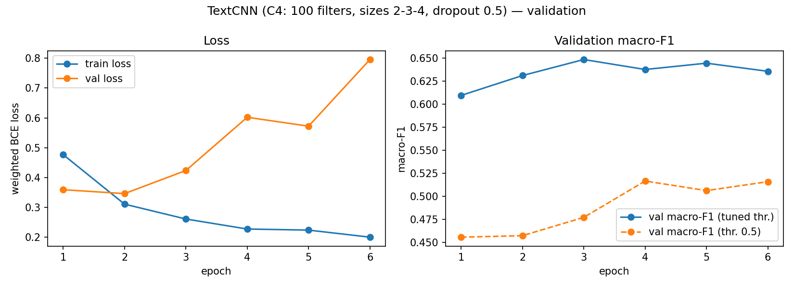

# 7. TextCNN Results

*Owner: M2 (Tharsiga Ranganathan). Result files: `results/textcnn_*`, `results/hparam_v2/`, `results/ablation/`.*

## 7.1 Evaluation protocol

All numbers in this section are on the **validation split** (23,936 comments). The test split is evaluated once, at the end, for all models together (Section 8). The main metric is **macro-F1**, the average F1 over the six labels, so the rare labels count as much as `toxic`. We also report micro-F1 and per-class F1.

For each label, the model's sigmoid probability is compared with a **per-class threshold**. We tune each threshold on validation to give the highest F1 for that label. Because the configuration, the best epoch and the thresholds are all chosen on validation, **validation scores are optimistic**. The test score is expected to be somewhat lower.

## 7.2 Hyperparameter search

We trained five configurations with the same seed (42), data and training settings (Section 6.3). Only the filters and dropout changed:

| Config | Filters | Widths | Dropout | Params (w/o emb.) | Val macro-F1 | Val micro-F1 | Best epoch / run | Train time |
|---|---:|---|---:|---:|---:|---:|---|---:|
| C1 | 100 | 3-4-5 | 0.5 | 122,106 | 0.6466 | 0.7419 | 5 / 8 | 184 s |
| C2 | 64 | 3-4-5 | 0.5 | 78,150 | 0.6450 | 0.7407 | 5 / 8 | 181 s |
| C3 | 128 | 3-4-5 | 0.5 | 156,294 | 0.6462 | 0.7464 | 3 / 6 | 140 s |
| **C4** | **100** | **2-3-4** | **0.5** | **92,106** | **0.6486** | 0.7463 | 3 / 6 | 136 s |
| C5 | 100 | 3-4-5 | 0.3 | 122,106 | 0.6421 | 0.7434 | 3 / 6 | 139 s |

**C4 is the final model.** It has the highest macro-F1, and it is also small and fast.

However, all five configurations lie within **0.0065** macro-F1 of each other, and this is from a single seed. A different random seed could easily change the order. So the honest conclusion is: **TextCNN is not sensitive to these settings.** C4 is the best in this run, but we cannot claim it is really better than C1 or C3. Doubling the filters (C2 → C3) did not help, and lower dropout (C5) was slightly worse.

Each epoch took about 23 s on a Colab T4 GPU thanks to the unfold + matmul convolution (Section 6.4). With the original `nn.Conv1d` (~296 s per epoch) this search would have taken about 13 times longer.

## 7.3 Threshold tuning: a bug and its fix

Our first search (v1) tuned thresholds on a grid from 0.05 to 0.95 in steps of 0.05. For the final model, **5 of the 6 thresholds hit the 0.95 upper limit**. This means the best threshold was probably above 0.95, but the grid could not reach it.

**Why are the thresholds so high?** We train with class weights (`pos_weight`). A rare label like `threat` gets a large weight, so the model is strongly punished for missing a positive, and it learns to give high probabilities to many comments. The cutoff that best separates real positives from the rest therefore sits very close to 1.

**The fix (v2).** We changed two things, and nothing else:

1. Use every possible cutoff (from scikit-learn's `precision_recall_curve`) instead of a fixed grid.
2. Compute the sigmoid in **float64**. In float32, many large logits round to exactly 1.0, so the model's scores tie and cannot be separated by any threshold.

The training was **identical** in v1 and v2: the losses and the F1 at a fixed 0.5 threshold match epoch by epoch. Only the threshold tuning changed. Results for the final model (C4):

| Label | v1 threshold | v2 threshold | v1 F1 | v2 F1 | Change |
|---|---:|---:|---:|---:|---:|
| toxic | 0.85 | 0.8335 | 0.781 | 0.7855 | +0.005 |
| severe_toxic | 0.95 (cap) | 0.9643 | 0.435 | 0.4613 | +0.026 |
| obscene | 0.95 (cap) | 0.9591 | 0.822 | 0.8275 | +0.006 |
| threat | 0.95 (cap) | 0.9973 | 0.482 | 0.5605 | **+0.079** |
| insult | 0.95 (cap) | 0.9156 | 0.715 | 0.7244 | +0.009 |
| identity_hate | 0.95 (cap) | 0.9964 | 0.425 | 0.5325 | **+0.108** |
| **Macro-F1** | | | **0.6099** | **0.6486** | **+0.039** |

Two observations:

- **The rare labels gained the most.** `threat` and `identity_hate` have the largest `pos_weight`, so their probabilities are pushed highest, and their best thresholds (≈ 0.997) were furthest above the cap.
- **For `insult`, the best threshold (0.9156) is below the cap**, yet F1 still improved. Here the coarse 0.05 step was the problem, not the cap.

The fix also changed the ranking of the five configurations:

| Config | v1 macro-F1 (capped grid) | v2 macro-F1 (all cutoffs) | Gain |
|---|---:|---:|---:|
| C1 | 0.5826 | 0.6466 | +0.064 |
| C2 | 0.6075 | 0.6450 | +0.038 |
| C3 | 0.6027 | 0.6462 | +0.044 |
| C4 | 0.6099 | 0.6486 | +0.039 |
| C5 | 0.6041 | 0.6421 | +0.038 |

C1 was the worst in v1 and is second-best in v2. The capped grid did not just lower the scores. It **distorted the comparison between models**, because it hurt some configurations more than others. For C1, the best `threat` threshold is **1.0** even in float64, which shows how extreme the over-confidence can be.

**Lesson for all models:** with class-weighted loss, thresholds must be tuned over the full range of cutoffs, not on a grid capped at 0.95. This applies to the shared evaluation code and the other models too.

## 7.4 Training curves: validation loss vs macro-F1

**Validation loss starts to rise after epoch 2, but tuned macro-F1 keeps improving until epoch 3.** Normally a rising validation loss means overfitting. Here, the model is becoming **over-confident**: its probabilities move towards 0 and 1, so the few confident mistakes are punished heavily by the loss. At the same time, the **ranking** of comments (which comment is more toxic than which) still improves, and per-class threshold tuning only needs a good ranking.

For this reason we use early stopping on **validation macro-F1**, not on validation loss. Stopping on loss would have picked epoch 2 and a weaker model. Training stopped after epoch 6 (patience 3), and the weights from epoch 3 were kept.

## 7.5 Final model: per-class results

Final model: **C4 with GloVe, validation macro-F1 0.6486, micro-F1 0.7463.**

| Label | Val positives | TP | FP | FN | Precision | Recall | F1 | Threshold |
|---|---:|---:|---:|---:|---:|---:|---:|---:|
| toxic | 2,294 | 1,807 | 500 | 487 | 0.783 | 0.788 | 0.786 | 0.8335 |
| severe_toxic | 240 | 158 | 287 | 82 | 0.355 | 0.658 | 0.461 | 0.9643 |
| obscene | 1,267 | 1,055 | 228 | 212 | 0.822 | 0.833 | 0.828 | 0.9591 |
| threat | 71 | 44 | 42 | 27 | 0.512 | 0.620 | 0.561 | 0.9973 |
| insult | 1,182 | 949 | 489 | 233 | 0.660 | 0.803 | 0.724 | 0.9156 |
| identity_hate | 211 | 131 | 150 | 80 | 0.466 | 0.621 | 0.533 | 0.9964 |

- **Frequent labels with clear words** (`obscene`, `toxic`) reach an F1 around 0.79–0.83.
- **The rare labels are much harder.** `severe_toxic`, `threat` and `identity_hate` have F1 between 0.46 and 0.56.
- **Recall is higher than precision for most labels.** Even with tuned thresholds, the model still flags too many comments, which fits the over-confidence seen in 7.4.
- `severe_toxic` has the lowest precision (0.355). Many of its false positives are probably toxic comments that are simply not *severe*. The line between the two labels is subjective.
- `threat` has only 71 positives, so one example changes its F1 by about 0.01. Its score is the least reliable.

## 7.6 Ablation: GloVe vs random embeddings

To measure the value of pre-trained embeddings, we trained C4 again with the same seed and settings, but with **randomly initialised** (still trainable) embeddings:

| Embeddings | Macro-F1 | Micro-F1 | toxic | severe_toxic | obscene | threat | insult | identity_hate | Best epoch / run |
|---|---:|---:|---:|---:|---:|---:|---:|---:|---|
| GloVe 6B 100d | **0.6486** | **0.7463** | 0.7855 | 0.4613 | 0.8275 | 0.5605 | 0.7244 | 0.5325 | 3 / 6 |
| Random init | 0.6259 | 0.7299 | 0.7691 | 0.4474 | 0.8072 | 0.5584 | 0.7123 | 0.4612 | 9 / 10 |
| **Gain from GloVe** | **+0.0227** | +0.0164 | +0.0164 | +0.0139 | +0.0203 | +0.0021 | +0.0121 | **+0.0713** | |

- **GloVe helps.** The macro-F1 gain (+0.023) is more than three times the spread between the five configurations (0.0065), so it is likely a real effect and not seed noise.
- **GloVe converges about three times faster**: best epoch 3 instead of 9.
- **The biggest gain is for `identity_hate` (+0.071).** Identity terms and group names are rare in our training data, but GloVe already knows they belong to a meaningful group of words from its huge training corpus.
- **`threat` gains almost nothing (+0.002).** Threats are often expressed by the *meaning of the whole sentence*, not by special words (7.7). Better word vectors do not fix that. The limit is TextCNN's short context (Section 6.5).

**Caveats.** This is one seed. Also, the random-init run found its best epoch at 9 of the 10-epoch limit, so it might still have improved with more epochs. The real gap may be somewhat smaller than +0.023.

## 7.7 Error analysis

We inspected 10 false positives and 10 false negatives from the validation predictions of the final model. The full list with row ids, probabilities and thresholds is in `results/textcnn_errors.md`. The main patterns:

**False positives (flagged but labelled clean):**

- **Label noise.** Some comments labelled clean are clear personal attacks (e.g. rows 16436, 11996). Here the model is arguably right.
- **Keyword triggering.** Profanity in a quoted or harmless context, such as song lyrics (row 6153) or a discussion of TV ratings (rows 1367, 682), is flagged.
- **Identity terms.** A neutral comment that mentions an identity group is flagged as `identity_hate` (row 8819).
- **Over-confidence.** All 10 false positives have probabilities ≥ 0.97.
- **Long comments.** 8 of the 10 false positives are longer than 128 tokens.

**False negatives (missed):**

- **Implicit threats without keywords.** For example, row 11252 ("ban me and die") gets a `threat` probability of only 0.147 against a threshold of 0.9973 (also rows 20082, 3569, 9345). There is no typical threat word, and the meaning comes from the sentence as a whole.
- **`identity_hate` without slurs** (rows 19044, 12982, 13018). Row 13018 is half Cyrillic, which our tokenizer cannot represent (Section 4.8).
- **Truncation.** In rows 19456 and 11901, the threatening part may be after token 128 and was cut off.
- **Inconsistent labels.** A standard Wikipedia warning is labelled `threat` (row 576). Quoted slurs are labelled `identity_hate` in one comment (row 12982) but clean in another (row 6153).

**Does GloVe help the rare classes?** Only partly. It clearly helped `identity_hate`, where the word meaning matters, but not `threat`, where the sentence meaning matters. This matches the ablation (7.6). This conclusion is based on one seed and very few examples, so it should be read as a trend, not a proven result.

## 7.8 Summary

- Final TextCNN (C4, GloVe): **validation macro-F1 0.6486, micro-F1 0.7463.**
- The choice of filters and dropout matters very little (spread 0.0065).
- **Proper threshold tuning mattered more than any model setting:** +0.039 macro-F1 with identical training.
- **GloVe gives +0.023 macro-F1** and three times faster convergence, mostly through `identity_hate`.
- TextCNN's main weakness is **short context**. It detects toxic words well, but misses toxicity carried by the whole sentence (implicit threats), and it over-reacts to toxic words used in harmless contexts.
- Some errors come from **label noise** in the dataset, which limits the score any model can reach.
